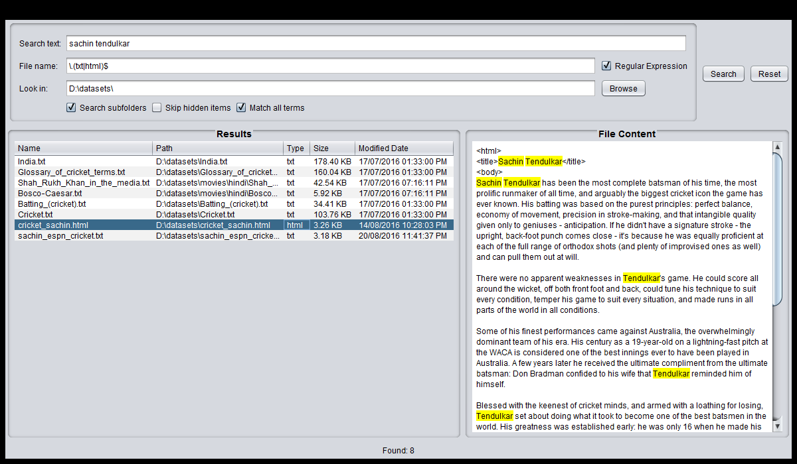

# Swift File Search 

Swift File Search is an Index based file Search Utility that searches one or more files on the Computer for occurrences of an input query and displays the results in the order of their relevance. The content in each of the files in search result can be viewed directly through the search tool without having to explicitly open it in an editor. It also provides a "UNIX find" like feature which can be used to fetch the list of files matching an input pattern.

Following are some of the major features available:
- Found text is shown highlighted in the content pane.
- An option to match one or more terms in the query instead of the entire search query.
- An option to skip sub-folders and only search for the files directly under a folder.
- An option to skip the hidden files in the system while searching.
- An option to only include files with a specific extension through the "File name" search field.(for e.g .txt will match all the text files).

###Running Swift File Search
1. Download the runnable jar from [here](target/fileSearch-1.0-jar-with-dependencies.jar).
2. Run the command *java -jar fileSearch-1.0-jar-with-dependencies.jar* 

